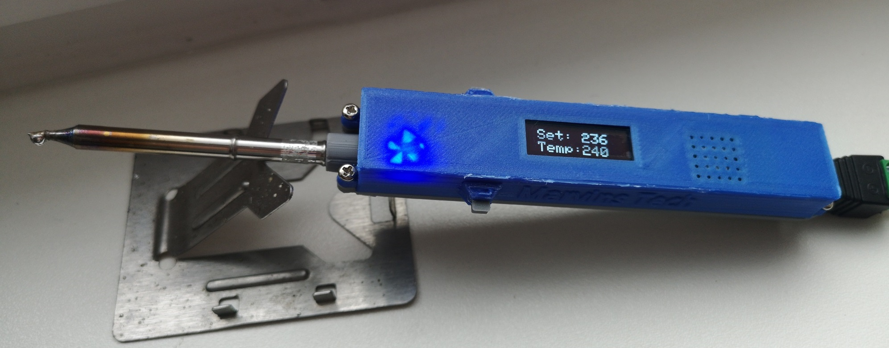
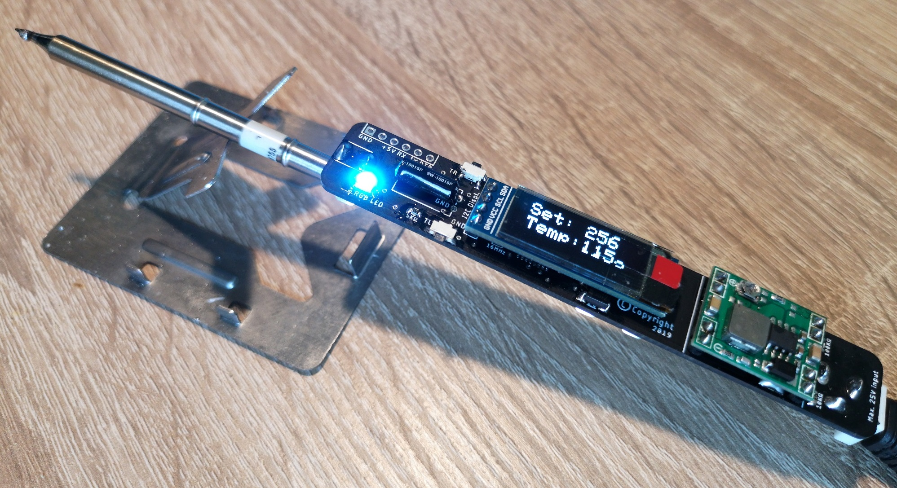
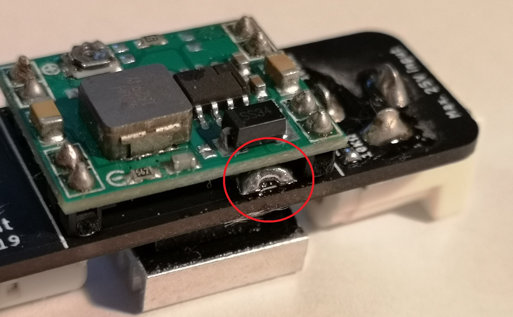
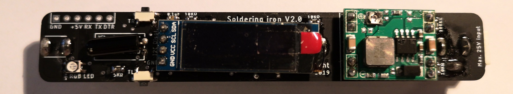
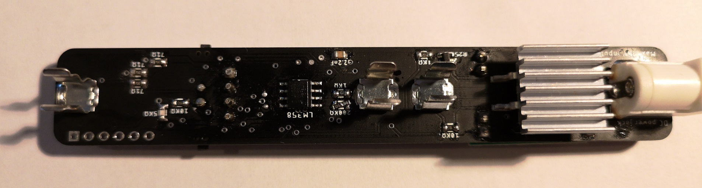
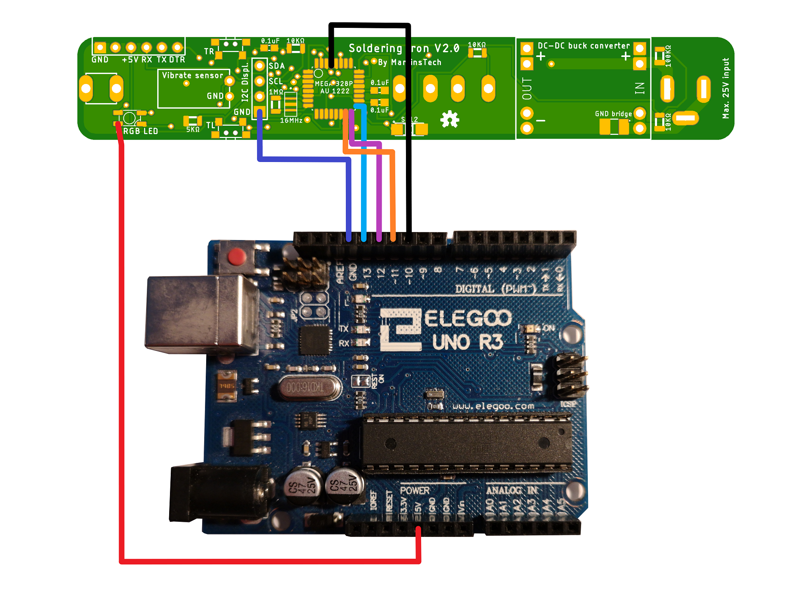
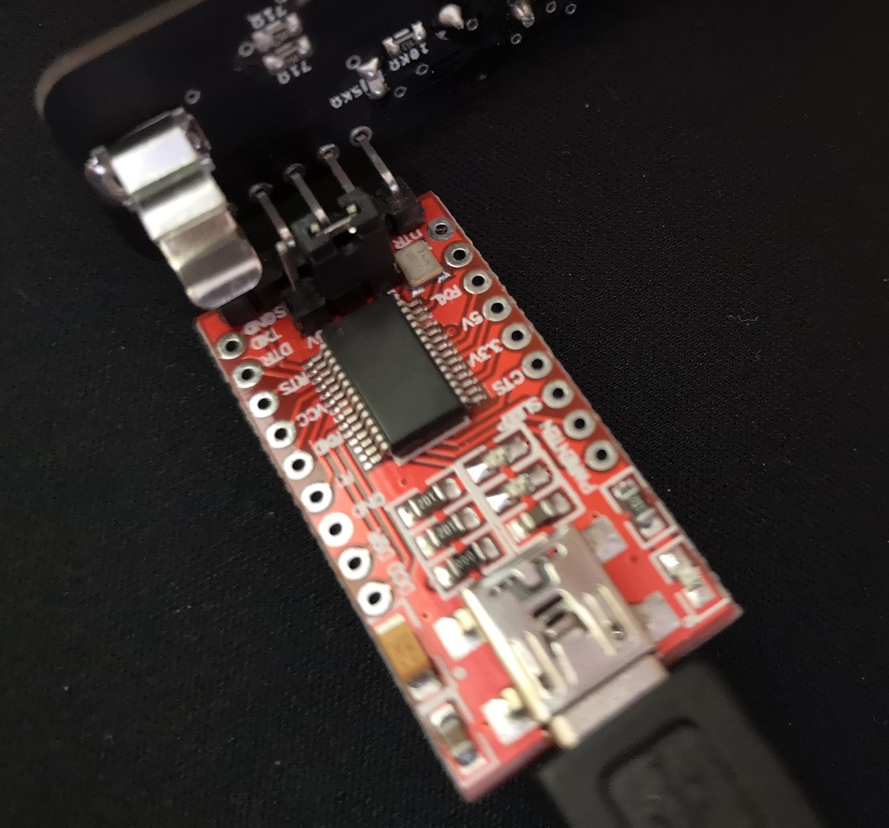

# Soldering-Iron

### Required parts
* 1x 
(To order the PCB, visit https://jlcpcb.com)
* 1x ATmega328pAU
* 1x Female DC power jack
* 1x 16MHz crystal SMD
* 1x SS12 Schottky diode
* 1x 2SC3356 R25 SOT-23
* 2x 1kΩ SMD Resistor
* 5x 10kΩ SMD Resistor
* 1x 1MΩ SMD Resistor
* 1x 200kΩ SMD Resistor
* 2x 5kΩ SMD Resistor
* 1x 100KΩ SMD Resistor
* 3x 71Ω SMD Resistor
* 1x 2,2nF SMD Capacitor
* 3x 100nF/0,1uF SMD Capacitor
* 3x PCB Fuse clip
* 1x LM358 LM358DR SOP8
* 2x 90° SMD Side push button 
* 1x Vibrate sensor SW-18015P
* 1x I2C OLED 128x32
* 1x IRF4905S MOSFET
* 1x RGB LED
* 1x USB B cable
* 1x T12 tip
* 1x Buck converter 22 * 17 * 5mm
* 1x FTDI module
* 1x Heatsink 14 * 14 * 8mm

### Hints
Note that the two points of the GND bridge are connected with solder!

### Completely soldered example

### Installing the bootloader on ATmega328
Almost all newly purchased ATmega328 microcontrollers lack the boot loader, so we have to install it ourselves. For this we need an Arduino that is connected as shown in the picture (Make sure that all components on the PCB except the display are soldered!). After the ATmega328 is connected to the Arduino via jumper cables, we have to install OptiLoader on the Arduino and see if it does not display an error message in the serial monitor. If no error message appears, the jumper cables can be unsoldered from the ATmega328.

https://github.com/WestfW/OptiLoader

### Load the program onto ATmega328
Before we load the program onto the ATmega328, we first have to implement the FTDI module in the Arduino IDE. To do this, follow the step-by-step instructions below.

* Open the Arduino IDE.
* Open the File > Preferences menu item.
* Enter the following URL in Additional Boards Manager URLs:
`https://mcudude.github.io/MiniCore/package_MCUdude_MiniCore_index.json`
* Open the Tools > Board > Boards Manager... menu item.
* Wait for the platform indexes to finish downloading.
* Scroll down until you see the MiniCore entry and click on it.
* Click Install.

Next we select the ATmega328 board from Tools, connect the FTDI module to the computer and upload the program to the PCB via the FTDI interface.

